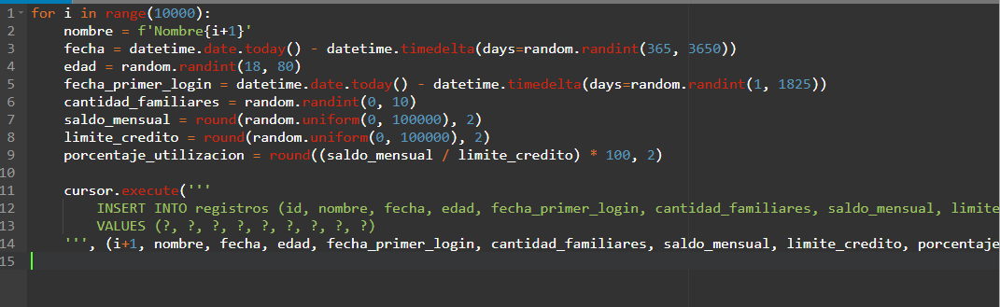
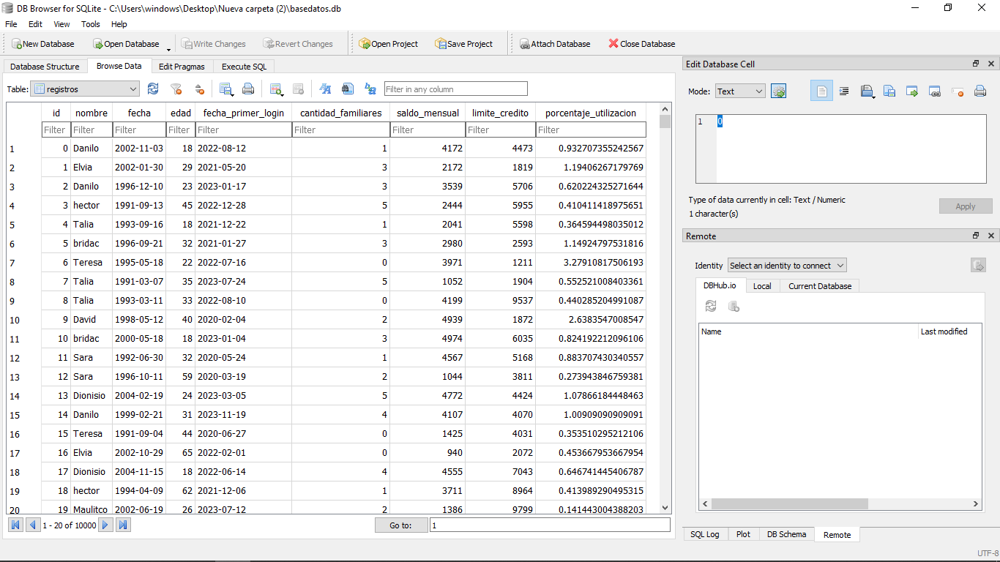
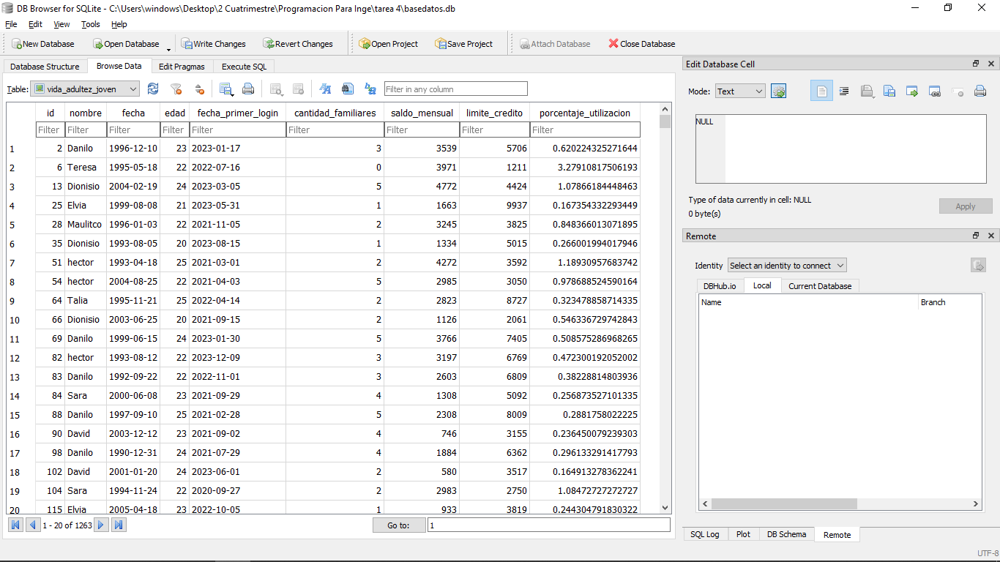
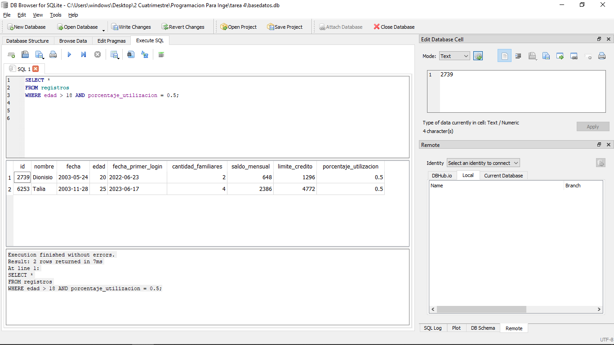

# Administracion-de-Base-de-Datos
Base de datos

Se realizo un administrador de base de datos con los siguientes datos:
Una base de datos aleatoria de unos 10,000 registros
La base posee los siguientes campos que son aleatorios
	Nombre
  Fecha
  Edad
	Fecha de Primer Login
  Cantidad de Familiares
	Saldo Mensual
	Limite de Crédito
	Porcentaje de utilización (Saldo Mensual / Límite de Crédito)

Importamos las librerias necesaria:

Establecemos conexion a la base de datos:

creamos una tabla de registro que ejecute una consulta a SQL  utilizando el método execute() del objeto cursor.

Generamos registros aleatorio. 

Una vez finalizado el codigo y lo ejecutemos en la terminal se nos creara un archivo "basededatos.bd" lo cual para poder abrirlo debemos ingresar a otro programa llamado 'DB Browser' y abrimos el archivo y se nos mostrara la base de datos de manera grafica.

Vista que agrupo todos los usuarios que esten en aduldez joven (20- 25 años)

Filtramos el dataset original para conseguir las personas que tengan un porcentaje de utilización del 50% y sean mayor de 18 años

